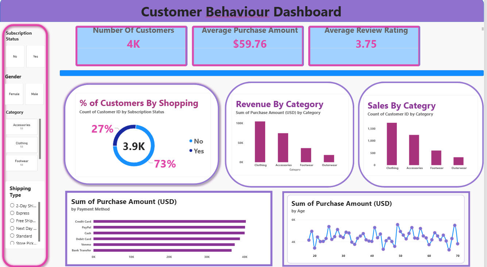

# Customer-Shopping-DashBoard
# Customer Shopping Behaviour Dashboard

### Tools Used: Power BI | SQL | Python | Excel

### 📊 Project Overview
Analyzed 3900+ customer records to understand shopping patterns, revenue trends, and customer segmentation.

### 📸 Dashboard Preview

### 📁 Files Included
- Business Problem Document.pdf
- Customer-Shopping-Behavior-Analysis.pptx
- QURIES.sql - 10 SQL queries
- customer_shopping_behavior.csv - Dataset
- customer_shopping.ipynb - Python EDA

### 🔍 Key Insights
- **Top Category:** Clothing - 33% of total revenue
- **Subscription:** 27% customers are subscribed members
- **Avg Purchase:** $59.76
- **Payment Method:** PayPal is most used
- **Gender:** Female customers purchase slightly more

### 🔗 Power BI Dashboard File
Customer Behaviour Dashboard.pbix is available in this repo
Created by Jannu Leela Madhuri | Data Analyst Aspirant
